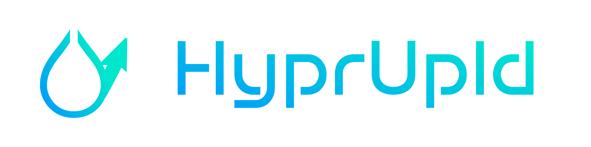

<div align="center">




[](https://discord.gg/PPTyhTAb6r)

**A versatile screenshot and file upload utility for Linux and MacOS with multi-platform support**

[](https://github.com/PhoenixAceVFX/hyprupld/blob/main/LICENSE)
[](https://github.com/PhoenixAceVFX/hyprupld/releases)

</div>

---

## Table of Contents

- [Quick Start](#quick-start)
- [Features](#features)
  - [Upload Services](#upload-services)
  - [Command Line Options](#command-line-options)
- [Desktop Environment Support](#desktop-environment-support)
- [Package Manager Support](#package-manager-support)
- [About](#about)
- [Resources](#resources)
- [License](#license)
- [Cleanup/Uninstall](#cleanupuninstall)

---

## Quick Start

To install HyprUpld, execute the following one-line command in your terminal:
### Linux
```bash
bash -c "$(curl -fsSL https://raw.githubusercontent.com/PhoenixAceVFX/hyprupld/main/install.sh)"
```
### Arch Linux PKGBUILD from AUR
```bash
yay -S hyprupld-git
```
### Arch Linux PKGBUILD from Github
```bash
bash -c "$(curl -fsSL https://raw.githubusercontent.com/PhoenixAceVFX/hyprupld/main/PKGBUILD.sh)"
```
### MacOS
```bash
bash -c "$(curl -fsSL https://raw.githubusercontent.com/PhoenixAceVFX/hyprupld/main/macos_install.sh)"
```

> **Note:** If downloading manually from the [releases page](https://github.com/PhoenixAceVFX/hyprupld/releases), remember to make the script executable with `chmod +x` before creating keybindings. This step is not needed when using the one-line installer.

---

## Features

### Upload Services

HyprUpld supports uploading to multiple services:

- [e-z.host](https://e-z.host)
- [fakecri.me](https://fakecri.me)
- [guns.lol](https://guns.lol)
- [nest.rip](https://nest.rip)
- [pixelvault.co](https://pixelvault.co)
- [imgur](https://imgur.com)
- **Zipline instances** (self-hosted image hosting)
- **XBackbone instances** (self-hosted image hosting)

### Command Line Options

HyprUpld offers various command-line options for flexibility:

```bash
hyprupld - Screenshot and Upload Utility

Usage: hyprupld [OPTIONS]

Options:
  -h, --help       Show this help message
  -debug           Enable Verbose Debug Logs
  -strict          Enable Strict Error Handling
  -reset           Reset all settings and start fresh
  -s, --save       Save screenshots to a specified directory
  -update          Update hyprupld to the latest version
  -mute            Mute sound feedback
  -silent          Silent mode (no sound or notification)
  -kill            Kill all running instances of hyprupld
  -uwsm            Enable UWSM compatibility mode for Hyprland

Screenshot Services:
  -guns            Use guns.lol
  -ez              Use e-z.host
  -fakecrime       Use fakecri.me
  -nest            Use nest.rip
  -pixelvault      Use pixelvault.co
  -zipline         Use a custom Zipline instance
  -xbackbone       Use a custom xBackBone instance
  -imgur           Use imgur.com

Environment Variables:
  HYPRUPLD_CONFIG  Override default config directory
  HYPRUPLD_DEBUG   Enable debug output when set to 1

Examples:
  hyprupld -guns              # Take screenshot and upload to guns.lol
  hyprupld                    # Take screenshot and copy to clipboard
  hyprupld -zipline https://example.com myauthkey  # Use custom Zipline instance
  hyprupld -xbackbone https://example.com token  # Use custom xBackBone instance
```

> **Note:** If no service is selected, the file will be copied to the clipboard.

### Local Screenshot Storage

When using the `-s` or `--save` option, HyprUpld will:
- Prompt for a base directory on first use
- Create a `hyprupld` folder in the chosen location
- Automatically organize screenshots by month (e.g., `march-2024`, `april-2024`)
- Save files with format: `hyprupld-YYYYMMDD-HHMMSS.png`

Example directory structure:
```
~/Pictures/
└── hyprupld/
    ├── january-2024/
    │   ├── hyprupld-20240115-143022.png
    │   ├── hyprupld-20240118-091545.png
    │   └── hyprupld-20240125-162033.png
    ├── february-2024/
    │   ├── hyprupld-20240203-104512.png
    │   └── hyprupld-20240220-155847.png
    ├── march-2024/
    │   ├── hyprupld-20240308-120934.png
    │   ├── hyprupld-20240315-094728.png
    │   └── hyprupld-20240329-183651.png
    └── april-2024/
        ├── hyprupld-20240401-141205.png
        └── hyprupld-20240412-095533.png
```

### Additional Features

- Interactive screenshot tool selection for each desktop environment
- Persistent configuration storage for settings and preferences
- Automatic package manager detection and fallback
- GUI dialogs for user interactions
- Debug mode for troubleshooting (`-debug`)
- **Mute and Silent Modes**: Use `-mute` to disable sound feedback or `-silent` to disable both sound and notifications.

### Configuration

HyprUpld stores its configuration in `~/.config/hyprupld/`:
- Authentication keys for upload services
- Preferred screenshot tools per desktop environment
- Screenshot save location preferences
- Package manager information

Use `-reset` to clear all saved settings and start fresh.

### Environment Variables

- `HYPRUPLD_CONFIG`: Override default config directory location
- `HYPRUPLD_DEBUG`: Enable debug output when set to 1
- Automatically detects `DISPLAY` and `WAYLAND_DISPLAY` for proper display server support

---

## Platform and Desktop Environment Support

### Operating Systems
- Linux (Primary support)
- macOS (Experimental)
  - Built-in screencapture tool
  - Third-party tools: CleanShot X, Xsnapper

### Desktop Environments
HyprUpld works seamlessly with various Linux desktop environments:

- KDE Plasma
- Hyprland
- GNOME
- XFCE
- i3
- Deepin
- Cinnamon
- Openbox
- MATE
- Sway
- Cosmic

---

## Package Manager Support

Installation is supported on systems using:

- Pacman (Arch)
- Apt (Debian/Ubuntu)
- DNF (Fedora)
- Nix-Env (NixOS)
- Emerge (Gentoo)
- Zypper (openSUSE)
- XBPS (Void)
- AUR Helpers (Yay/Paru)

---

## About

HyprUpld is an all-in-one screenshot tool designed to streamline the process of capturing and uploading screenshots across Linux and macOS (experimental) platforms.

For more information, visit the [official website](https://hyprupld.space).

---

## Resources

- **GitHub Discussions**: Join the conversation, ask questions, and share ideas in our [Discussions](https://github.com/PhoenixAceVFX/hyprupld/discussions) section
- **Issues**: Report bugs and request features in the [Issues](https://github.com/PhoenixAceVFX/hyprupld/issues) section
- **Website**: Visit the [official website](https://hyprupld.space) for more information

---

## Contributing

We welcome contributions to HyprUpld! Please see our [Contributing Guidelines](CONTRIBUTING.md) for detailed information on:
[➡️ Full Documentation (User & Developer Guides)](docs/README.md)

- How to report bugs and request features
- Development setup and workflow
- Code style and standards
- Submitting pull requests

---

## AppImage Support

- Pre-built AppImages are available in the [Releases](../../releases) section
- Can be compiled using the included `compile.sh` script
- Automatic builds generated from the latest commit
- Functionally identical to the standard scripts

## Installation

The `install.sh` script:
- Places executables in `/usr/local/bin`
- Sets appropriate permissions
- Verifies PATH configuration
- Handles dependency installation

To install:
1. Clone the repository or download the release package
2. Run `bash compile.sh` to build from source
3. Run `bash install_scripts.sh`

## Cleanup/Uninstall

To remove HyprUpld and all its components from your system, run:
```bash
bash -c "$(curl -fsSL https://raw.githubusercontent.com/PhoenixAceVFX/hyprupld/main/cleanup.sh)"
```

The cleanup script will:
- Remove all installed binaries and symlinks
- Remove configuration files (with confirmation)
- Remove sound files (with confirmation)
- Remove source directory (with confirmation)
- Clean up any remaining components

The script is interactive and will ask for confirmation before removing each component, ensuring you don't accidentally delete anything important.

## Dependencies

### Core Tools
* [curl](https://github.com/curl/curl) - Command line tool for transferring data
* [xclip](https://github.com/astrand/xclip) - Command line interface to X selections (clipboard)
* [wl-clipboard](https://github.com/bugaevc/wl-clipboard) - Command line interface to Wayland selections (Clipboard)
* [fyi](https://github.com/Macchina-CLI/fyi) - Minimal desktop notifications
* [zenity](https://gitlab.gnome.org/GNOME/zenity) - Display graphical dialog boxes from shell scripts
* [python](https://github.com/python) - Replacing JQ as a JSON Processor
* [sips](https://developer.apple.com/documentation/sips) - Command line tool for macOS
* [osascript](https://developer.apple.com/documentation/appscript) - Command line tool for macOS
* [zip](https://github.com/infozip/zip) - Command line tool for creating zip archives

### Screenshot Tools
* [grimblast](https://github.com/hyprwm/contrib) - For Sway and i3
* [hyprshot](https://github.com/your-repo/hyprshot) - For Hyprland
* [spectacle](https://github.com/KDE/spectacle) - For KDE Plasma
* [gnome-screenshot](https://gitlab.gnome.org/GNOME/gnome-screenshot) - For GNOME
* [xfce4-screenshooter](https://docs.xfce.org/apps/xfce4-screenshooter/start) - For XFCE
* [scrot](https://github.com/resurrecting-open-source-projects/scrot) - For i3, Openbox, and other minimal WMs
* [deepin-screenshot](https://github.com/linuxdeepin/deepin-screenshot) - For Deepin
* [mate-screenshot](https://github.com/mate-desktop/mate-utils) - For MATE
* [grim](https://github.com/emersion/grim) - For Sway
* [screencapture](https://developer.apple.com/documentation/appkit/screencapture) - For macOS
* [cleanshot](https://cleanshot.com) - For macOS
* [xsnapper](https://xsnapper.com) - For macOS

## Issues and Support
Please use the [Issues](../../issues) section to:
- Report bugs
- Request new features
- Request additional upload service support

---

## Frequently Asked Questions

### **Q: Why isn't my screenshot tool being detected?**
A: HyprUpld automatically detects your desktop environment and suggests appropriate screenshot tools. If detection fails, you can manually install the recommended tool for your DE or use the debug mode (`hyprupld -debug`) to troubleshoot.

### **Q: How do I set up custom keybindings?**
A: The setup depends on your desktop environment. After installation, configure your DE's keyboard shortcuts to run `hyprupld` with your preferred options (e.g., `hyprupld -guns` for guns.lol upload).

### **Q: Can I use multiple upload services?**
A: Yes! You can configure multiple services and switch between them using different command-line flags. Each service can have its own API key stored securely.

### **Q: My upload is failing. How do I troubleshoot?**
A: First, try running with debug mode (`hyprupld -debug`) to see detailed logs. Check your internet connection, verify your API keys are correct, and ensure the upload service is accessible.

### **Q: Where are my API keys stored?**
A: API keys are stored securely in `~/.config/hyprupld/` with appropriate file permissions. You can reset all settings using `hyprupld -reset` if needed.

### **Q: Does HyprUpld work on Wayland?**
A: Yes! HyprUpld automatically detects your display server (X11/Wayland) and uses the appropriate clipboard and screenshot tools.

---

## License

This project is licensed under the [GPL-2.0 License](https://github.com/PhoenixAceVFX/hyprupld/blob/main/LICENSE).

---

*For any issues or contributions, please visit the [GitHub repository](https://github.com/PhoenixAceVFX/hyprupld).*

--- 

Created by PhoenixAceVFX